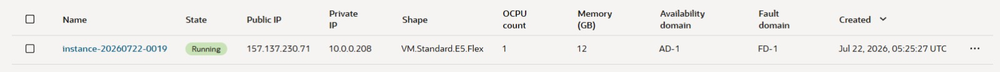
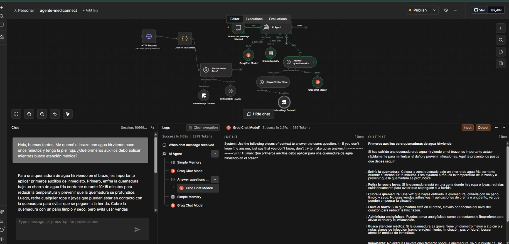

# 🏥 MediConnect AI - Clinical Assistant (OCI + n8n)

MediConnect AI es un agente conversacional inteligente diseñado para la atención clínica primaria, triaje inicial y gestión de consultas médicas en tiempo real. Está construido sobre **n8n** y desplegado en producción en **Oracle Cloud Infrastructure (OCI)**.

---

## 🏗️ Arquitectura del Sistema

* **Hosting & Cloud:** Oracle Cloud Infrastructure (OCI) - Instancia Compute Ubuntu.
* **Orquestador:** n8n (Production Workflow).
* **Motor de IA (LLM):** Groq / Llama 3.3 70B Versatile (Inferencia de ultra baja latencia).
* **Arquitectura de Memoria:** Window Buffer Memory para retención de contexto conversacional.
* **Integración RAG:** Documentos base de triaje clínico y guías de atención.

---

## 📸 Evidencia de Despliegue y Funcionamiento

### Instancia Activa en Oracle Cloud Infrastructure


### Flujo de Trabajo en n8n y Chat

## 📂 Estructura del Repositorio

```text
.
├── README.md                  # Documentación oficial del proyecto
├── mediconnect-workflow.json   # Exportación del flujo funcional en n8n
├── datos_clinica/             # Base de conocimiento / Archivos RAG
└── assets/                    # Capturas de pantalla y evidencias
